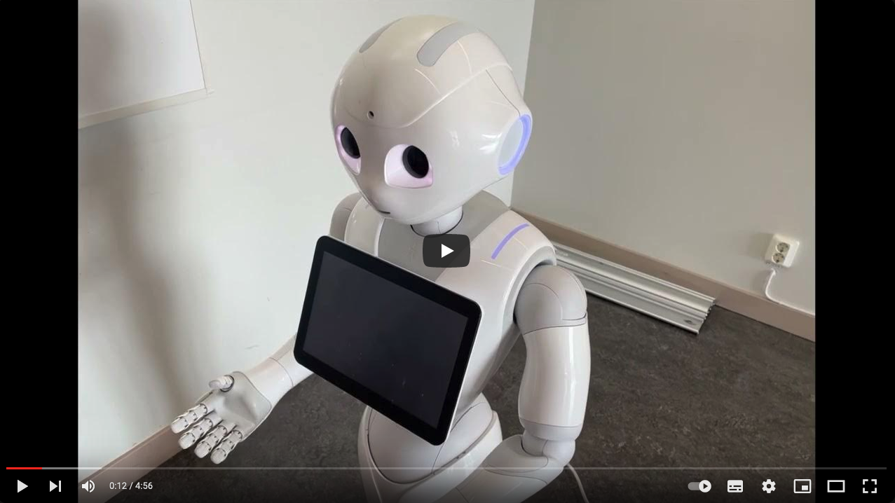
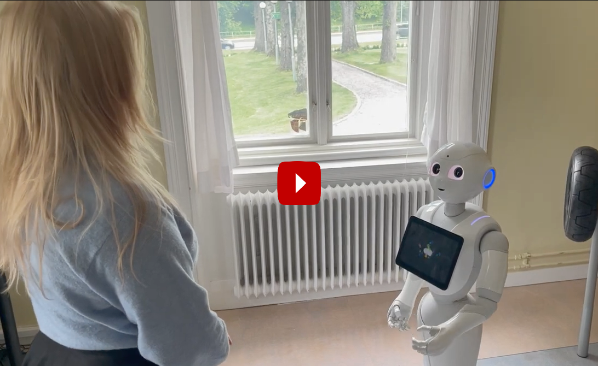

# Pepper Chat

The code interfaces [OpenAI ChatGPT](https://openai.com/) with the [Aldebaran](https://www.aldebaran.com/en) Pepper and Nao robots, allowing open verbal conversation with these robots on a wide range of subjects.

## Video of the Result

### April 2024 update
[](https://youtu.be/1T3SLaut6wI?si=lggZ70EGl287Ke1G)

### Original rlease, June 2022
[](https://youtu.be/zip90jyv1i4)

## Installation

[PepperChat](https://github.com/ilabsweden/pepperchat) depends on the NaoQi software to interface with the Pepper and Nao robots, and the OpenAI API to interface with ChatGPT. Please refer to the detailed setup instructions below for your preferred operating system. 

### Setup for Windows

NaoQi is old and runs on Python 2.7 while OpenAI requires Python 3. We therefore need both Python versions installed. Here's a step by step guide for setup on Windows 11.

1. Make sure Python 3.x is installed on the system. 
1. Install [Python 2.7](https://www.python.org/downloads/release/python-2718/). Select the 32 bit msi installer.
1. Add ```C:\Python27``` to the environment PATH.
1. Open a terminal and verify that ```python``` refers to Python2.7 and ```python3``` refers to your Python 3.x distribution. 

Now we need a few of dependencies:

* Install all dependencies for Python 2: ```python2 -m pip install -r .\requirements.py2.txt```
* Install all dependencies for Python 3: ```python3 -m pip install -r .\requirements.py3.txt```

We will use VS Code to run things, you may also use another environment if you prefer. 

Now we need the Python NaoQi API for communicating with the Pepper robot. 

* Download and extract NaoQi Python SDK for [Nao](https://support.unitedrobotics.group/en/support/solutions/articles/80001018812-nao-6-downloads) or [Pepper](https://support.unitedrobotics.group/en/support/solutions/articles/80001024221-pepper-2-5-downloads) 
* Add the pynaoqi folder (e.g. *pynaoqi-python2.7-2.5.7.1-win32-vs2013/lib*) to the PYTHONPATH environment variable in Windows. 
* You may also want to install *Choreographe* for [Nao](https://support.unitedrobotics.group/en/support/solutions/articles/80001018812-nao-6-downloads) or [Pepper](https://support.unitedrobotics.group/en/support/solutions/articles/80001024221-pepper-2-5-downloads). It is however not strictly needed to run *Pepper Chat*.

Finally, we are ready to check out the repository. 

* Check out this repository and open the folder in VS Code
* Open a terminal and run ```python init.py``` to set up a default environment. Have your OpenAI account key available so that this can be stored with your configuration. 

### Setup for OSX and Linux

NaoQi is old and runs on Python 2.7 while OpenAI requires Python 3. 

1. Open a terminal and verify that ```python2``` refers to Python2.7 and ```python3``` refers to your Python 3.x distribution. If any of them are missing, please install through your preferred package manager.  

Now we need a few of dependencies:

* Install all dependencies for Python 2: ```python2 -m pip install -r .\requirements.py2.txt```
* Install all dependencies for Python 3: ```python3 -m pip install -r .\requirements.py3.txt```

We are now ready to check out the repository:

* Check out this repository and open the folder in VS Code
* Open a terminal and run ```python init.py``` to set up a default environment. Have your OpenAI account key available so that this can be stored with your configuration. 

We will use [VS Code](https://code.visualstudio.com/) to run things, you may also use another environment if you prefer. 

Now we need the Python NaoQi API for communicating with the Pepper robot. 

* Download and extract NaoQi Python SDK for [Nao](https://support.unitedrobotics.group/en/support/solutions/articles/80001018812-nao-6-downloads) or [Pepper](https://support.unitedrobotics.group/en/support/solutions/articles/80001024221-pepper-2-5-downloads) matching the version of your robot's software. Tested with NAOqi 2.5.10.7.
* Update your terminal profile (e.g. *.zshrc*) with the following:
    * export PYTHONPATH=${PYTHONPATH}:/path/to/python-sdk/lib/python2.7/site-packages
    * export DYLD_LIBRARY_PATH=${DYLD_LIBRARY_PATH}:/path/to/python-sdk/lib
    * export QI_SDK_PREFIX=/path/to/python-sdk
* Start ```python2``` and make sure you can import ```naoqi```. OSX may throw a lot of warnings the first time NaoQi is imported. Google for the exact way to approve these. 

I haven't been able to make Choreographe to run on recent versions of OSX, but it's not needed for running this app. 

## Run
Make sure you've gone through all steps in the Setup guide above before you start. 

Note that the Speech recognition module uses a NaoQi (*Autonomous Life Proxy*) to switch focus to *nao_focus*. You may not have this script on your own robot and the the code will throw an exception as a result. This call is made solely to prevent the default dialogue system of the robot to interfere with PepperChat. You may safely comment this away or upload your own preferred focus script to the robot, e.g. using Choreograph. 

* Start the OpenAI ChatGPT chatbot service by opening a terminal and execute ```python3 startDialogueServer.py```. If everything goes well, the server should respond with _Starting OpenAI chat server...
Type an input message to test your chatbot..._
* Next, start Google's text to speech recognition service for Pepper by opening a new terminal and execute ```python module_speechrecognition.py --pip pepper.local``` (where _pepper.local_ refers to your robot's ip).
* We are now ready to start the dialogue service by opening another terminal and executing ```python module_dialogue.py --pip pepper.local```. This script will ask for a participant id and then connect to the OpenAI chatbot server we started earlier. If everything goes well it will continue and register another NaoQi module that runs the dialogue. _Pepper should now be ready to chat!_

## License

This project is released under the MIT license. Please refer to [LICENSE.md](LICENSE.md) for license details.

Parts of the source code have specific license formulations. Please see the file headers for details. 

## Publications

Erik Billing, Julia Rosén, and Maurice Lamb. 2023. [Language Models for Human-Robot Interaction](doc/Billing_etal_2023-Language_models_for_HRI.pdf). In Companion of the 2023 ACM/IEEE International Conference on Human-Robot Interaction (HRI ’23 Companion), March 13–16, 2023, Stockholm, Sweden. ACM, New York, NY, USA, 2 pages. https://doi.org/10.1145/3568294.3580040.

## Acknowledgments

* Erik Billing @ University of Skövde, Sweden - for implementing the OpenAI GPT-3 dialogue system. 
* Igor Lirussi @ Cognitive Learning and Robotics Laboratory at Boğaziçi University, Istanbul - for providing an [AIML-based dialogue system](https://github.com/igor-lirussi/Dialogue-Pepper-Robot) on which this project is built. 
* Johannes Bramauer @ Vienna University of Technology - for the [PepperSpeechRecognition](https://github.com/JBramauer/pepperspeechrecognition)
* Anthony Zang (Uberi) and his [SpeechRecognition](https://github.com/Uberi/speech_recognition)
